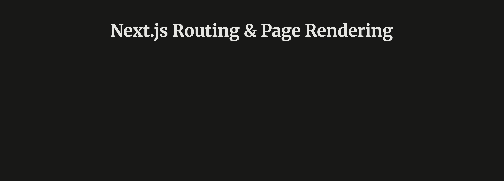
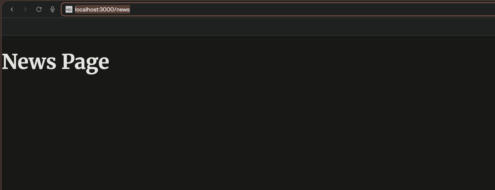
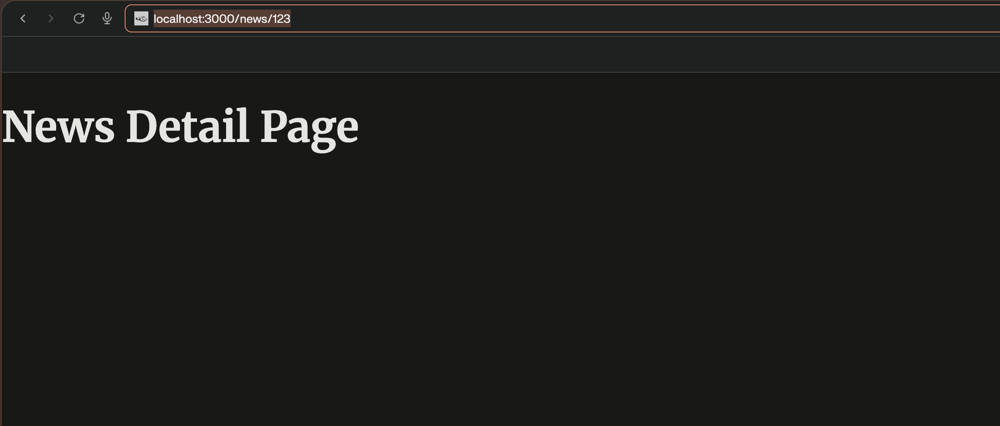
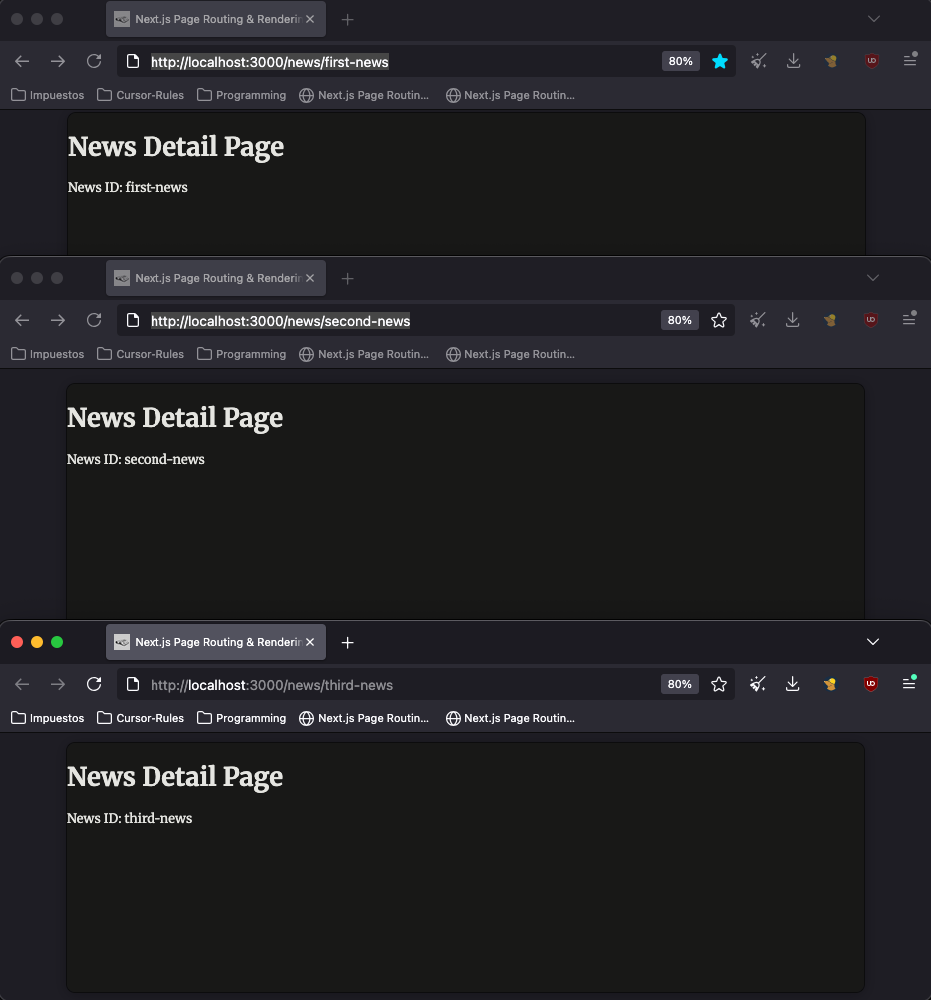
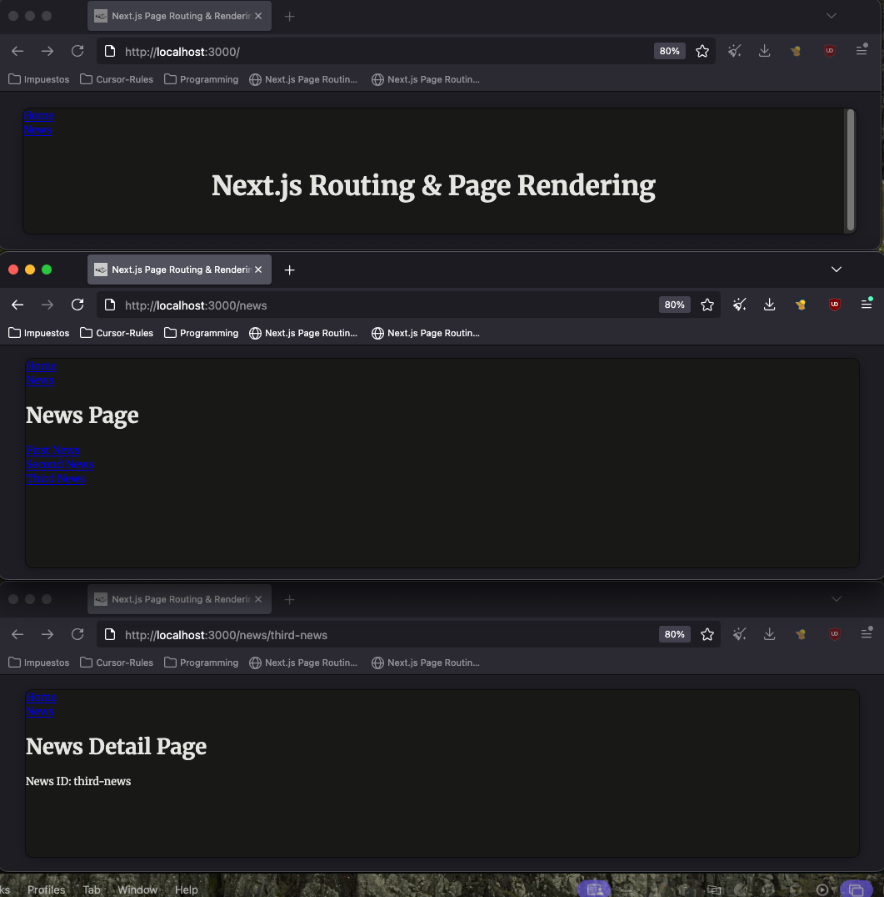
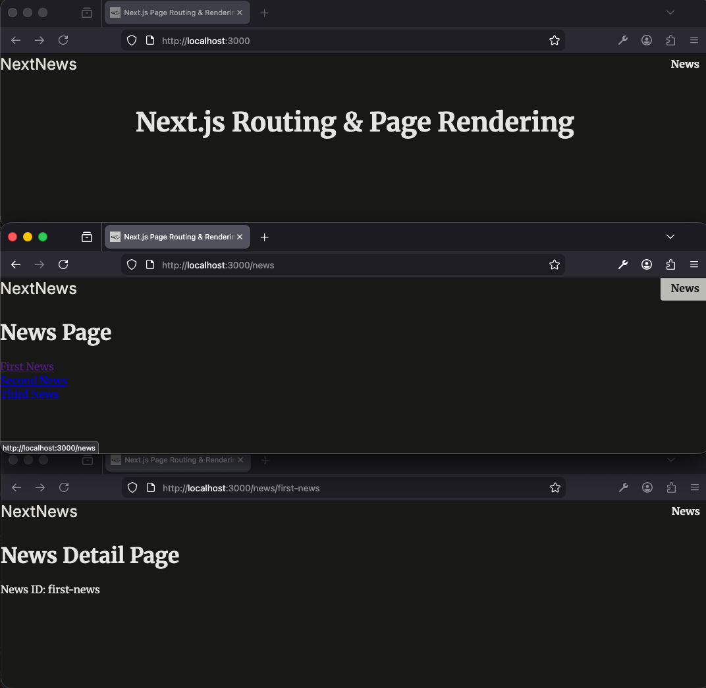
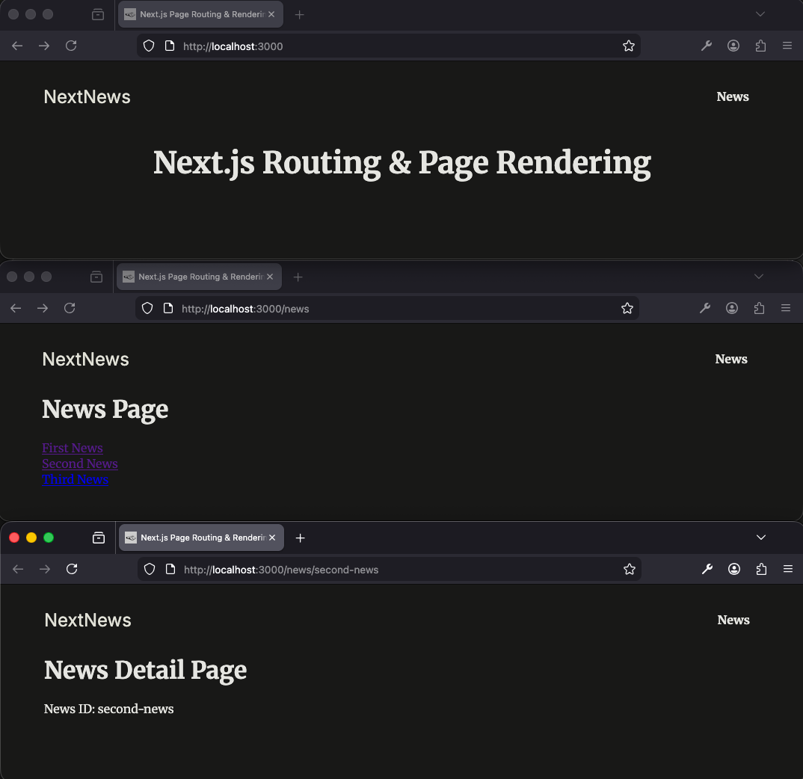
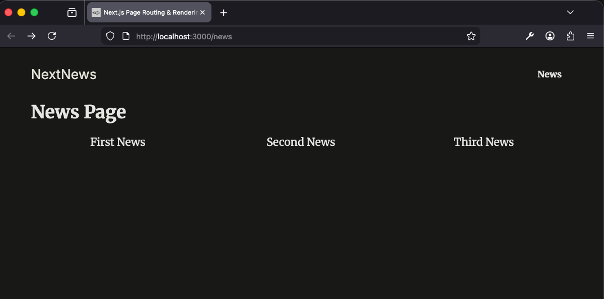
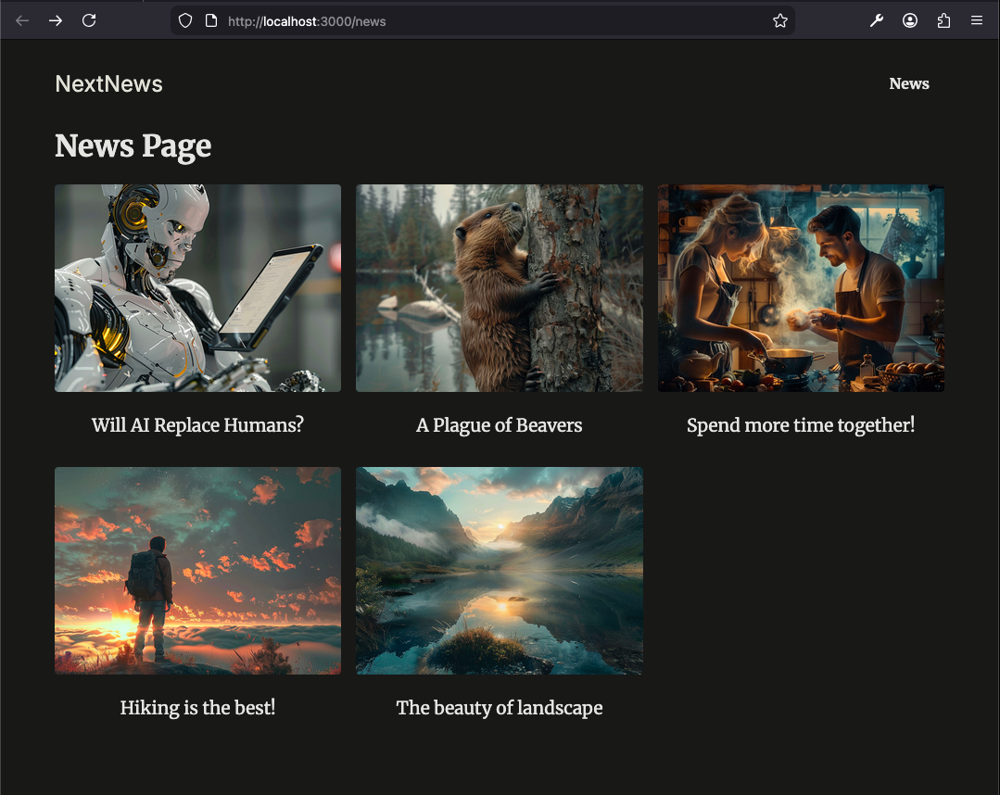
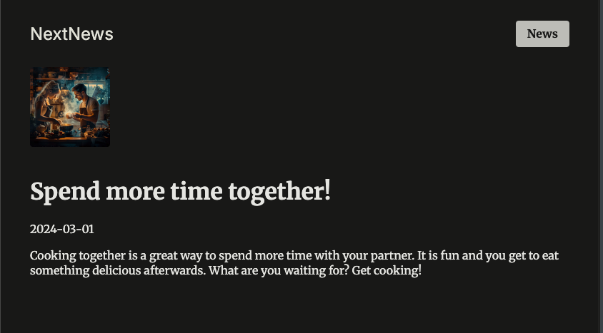

## 🧳 Section 04 - *Routing & Page Rendering - Deep Dive*


<br>

## 🔧 136. Lesson 136 — *Project Setup, Overview & An Exercise!*

[🧳 Section 04: Routing & Page Rendering - Deep Dive](#section-04---routing--page-rendering---deep-dive)

### 📑 Table of Contents:
- [136. Lesson 136 — *Project Setup, Overview & An Exercise!*](#-136-lesson-136--project-setup-overview--an-exercise)
- [136.1 Context](#-1361-context)
- [136.2 Updating code/theory according the context](#-1362-updating-codetheory-according-the-context)
  - [136.2.1 Download Starting Project Template](#13621-download-starting-project-template)
  - [136.2.2 Install Dependencies](#13622-install-dependencies)
  - [136.2.3 Start Development Server](#13623-start-development-server)
- [136.3 Issues](#-1363-issues)
- [136.4 Pending Fixes (TODO)](#-1364-pending-fixes-todo)

### 🧠 136.1 Context:

This lesson establishes the foundational Next.js project used throughout **Section 04 — Routing & Page Rendering**. The starting template provides a minimal App Router setup with essential files and styling to build upon in subsequent lessons.

**Key Concepts:**
1. **App Router structure** — The project uses Next.js 14 App Router with `app/page.js` (home), `app/layout.js` (root layout), and `app/globals.css` for shared styles.
2. **File-based routing** — Pages map to the `app/` directory; `app/page.js` serves as the root `/` route.
3. **Project bootstrapping** — Installing dependencies and running the dev server prepares the workspace for exploring routing and rendering features.

**Advantages:**
- Minimal starting point reduces cognitive load when learning routing concepts
- Pre-configured `globals.css` with Merriweather/Inter fonts and dark theme styling
- Clear separation between layout (metadata, shell) and page content
- Standard npm scripts (`dev`, `build`, `start`, `lint`) for development workflow

**Disadvantages/Gotchas:**
- Template must be downloaded externally; no `create-next-app` used
- Path to zip may change if the course repository is updated
- `node_modules` must be installed manually after extracting the template

**When to Consider Alternatives:**
- Use `create-next-app` if starting a project from scratch without a course template
- Use `pnpm` or `yarn` instead of `npm` if your ecosystem prefers them (commands differ slightly)

---

### ⚙️ 136.2 Updating code/theory according the context:

#### **Summary**
- This section walks through getting the routing-rendering project running: obtaining the starting template, installing dependencies, and launching the dev server.
- Subsections 136.2.1–136.2.3 are sequential steps that build the working development environment.
- The goal is to have a local Next.js app ready for Section 04 exercises.

#### 136.2.1 Download Starting Project Template

**Subsection Summary**
- Provides the GitHub URL for the `01-starting-project.zip` from Maximilian Schwarzmüller's Next.js course resources.
- The template includes the baseline `app/` structure (`page.js`, `layout.js`, `globals.css`), `package.json` with Next.js 14, and `next.config.mjs`.
- Serves as the canonical starting point before any routing or rendering modifications.

* Template in here URL: [mschwarzmueller / nextjs-complete-guide-course-resources](https://github.com/mschwarzmueller/nextjs-complete-guide-course-resources/blob/main/attachments/03-routing-rendering/01-starting-project.zip)


#### 136.2.2 Install Dependencies

**Subsection Summary**
- Installs project dependencies (React, React DOM, Next.js) into `node_modules`.
- Ensures the project has all required packages before running the dev server.
- Uses `npm i` as the standard npm install command for the course.

* Update `node_modules` folder

```bash
npm i
```

#### 136.2.3 Start Development Server

**Subsection Summary**
- Starts the Next.js development server with hot reloading via `npm run dev`.
- The app runs locally (typically at `http://localhost:3000`) and displays the "Next.js Routing & Page Rendering" homepage.
- The screenshot illustrates the running app with the dark-themed welcome page.

* Open the app:

```bash
npm run dev
```




### 🐞 136.3 Issues:

- Documentation typo: Section header uses "Rendenring" instead of "Rendering".
- Missing image asset: `docs/../img/section04-lecture136-001.png` may not exist; the reference breaks if the `img` folder or file is absent.
- Placeholder issue text "first issue: something.." was non-actionable and has been replaced with concrete items.

| Issue | Status | Log/Error |
|---|---|---|
| Section title typo "Rendenring" | ✅ Fixed | `docs/LECTURE_STEPS.md:3` — Corrected to "Rendering" |
| Missing screenshot `section04-lecture136-001.png` | ⚠️ Identified | `img/section04-lecture136-001.png` — Image path referenced but asset may be missing |
| Placeholder issue text | ✅ Fixed | Replaced with real issues |

### 🧱 136.4 Pending Fixes (TODO)

- [ ] Add `img/section04-lecture136-001.png` screenshot of the app running at `localhost:3000` (or update path if image lives elsewhere)
- [ ] Ensure `img/` directory exists under project root and is committed if using version control

[↑ top — 136. Lesson 136 — *Project Setup, Overview & An Exercise!*](#-136-lesson-136--project-setup-overview--an-exercise)


<br>

## 🔧 137. Lesson 137 — *Exercise Solution - Part 1*

[🧳 Section 04: Routing & Page Rendering - Deep Dive](#section-04---routing--page-rendering---deep-dive)

### 📑 Table of Contents:
- [137. Lesson 137 — *Exercise Solution - Part 1*](#-137-lesson-137--exercise-solution---part-1)
- [137.1 Context](#-1371-context)
- [137.2 Updating code/theory according the context](#-1372-updating-codetheory-according-the-context)
  - [137.2.1 Create News List Page](#13721-create-news-list-page)
  - [137.2.2 Create News Detail Page with Dynamic Route](#13722-create-news-detail-page-with-dynamic-route)
  - [137.2.3 Add Links to News Items](#13723-add-links-to-news-items)
  - [137.2.4 Extract and Display Dynamic ID from Params](#13724-extract-and-display-dynamic-id-from-params)
- [137.3 Issues](#-1373-issues)
- [137.4 Pending Fixes (TODO)](#-1374-pending-fixes-todo)

### 🧠 137.1 Context:

This lesson implements **Part 1** of the exercise from Lesson 136: building a News section with a list page (`/news`) and dynamic detail pages (`/news/[id]`). It introduces Next.js App Router concepts for nested routes and client-side navigation.

**Key Concepts:**
1. **Nested routes** — `app/news/page.js` serves `/news`, and `app/news/[id]/page.js` serves `/news/first-news`, `/news/second-news`, etc. Folder structure defines URL hierarchy.
2. **Dynamic route segments** — The `[id]` folder creates a dynamic segment; any value after `/news/` is captured as `params.id`.
3. **`Link` component** — Next.js `Link` from `next/link` enables client-side navigation without full page reloads; prefer it over `<a href>` for internal routes.
4. **Page props** — In Next.js App Router, page components receive `params` (and optionally `searchParams`) as props; `params` contains the values for dynamic segments.

**Advantages:**
- File-based routing keeps routes and components aligned; no manual route configuration
- `Link` prefetches linked pages for faster perceived performance
- Dynamic segments scale to any number of news items without extra files
- Clear separation between list (NewsPage) and detail (NewsDetailPage) components

**Disadvantages/Gotchas:**
- In Next.js 15+, `params` becomes a Promise and must be awaited (this project uses Next.js 14 where it is synchronous)
- Incorrect URL structure (e.g. `/first-news` instead of `/news/first-news`) leads to 404s
- `Link` requires `href` to be an internal path; external URLs need `<a>` with `target="_blank"`

**When to Consider Alternatives:**
- Use `useRouter().push()` for programmatic navigation (e.g. after form submit)
- Use `generateStaticParams` for static generation of known dynamic routes
- Add loading/error boundaries for better UX on slow or failing routes

---

### ⚙️ 137.2 Updating code/theory according the context:

#### **Summary**
- This section builds the News feature in four steps: a basic list page, a dynamic detail page, Link-based navigation between them, and displaying the dynamic ID.
- Subsections 137.2.1–137.2.4 progress from static pages to dynamic, linked content.
- The goal is to demonstrate nested routes, dynamic segments, and the `Link` component in a single flow.

#### 137.2.1 Create News List Page

**Subsection Summary**
- Creates the News list page at `/news` using `app/news/page.js`.
- Renders a simple heading; the screenshot shows the initial state before adding links.
- Establishes the parent route for the News section.

```js
/* app/news/page.js */
export default function NewsPage(){
  return(
    <>
      <h1>News Page</h1>
    </>
  )
}
```

* Go to the [following URL](http://localhost:3000/news)



#### 137.2.2 Create News Detail Page with Dynamic Route

**Subsection Summary**
- Creates a dynamic route with `app/news/[id]/page.js` so URLs like `/news/first-news` map to this component.
- Initially shows a static "News Detail Page" heading; the screenshot illustrates the placeholder before params are used.
- Demonstrates the folder naming convention `[id]` for dynamic segments in the App Router.

```jsx
/* app/news/[id]/page.js */
export default function NewsDetailPage(){
  return (
    <>
      <h1>News Detail Page</h1>
    </>
  );
}
```



#### 137.2.3 Add Links to News Items

**Subsection Summary**
- Imports `Link` from `next/link` and adds three list items linking to `/news/first-news`, `/news/second-news`, and `/news/third-news`.
- Enables client-side navigation from the list page to each detail page without full reloads.
- Uses the Next.js `Link` component for optimal prefetching and routing behaviour.

```jsx
/* app/news/page.js */
import Link from "next/link";                                       // 👈🏽 ✅ (1)

export default function NewsPage(){
  return(
    <>
      <h1>News Page</h1>
      <ul>
        <li>
          <Link href="/news/first-news">First News</Link>           {/* 👈🏽 ✅ (2) */}
        </li>
        <li>
          <Link href="/news/second-news">Second News</Link>         {/* 👈🏽 ✅ (2) */}
        </li>
        <li>
          <Link href="/news/third-news">Third News</Link>           {/* 👈🏽 ✅ (2) */}
        </li>
      </ul>
    </>
  )
}
```

#### 137.2.4 Extract and Display Dynamic ID from Params

**Subsection Summary**
- Destructures `params` from the page props and extracts `id` to display the current segment value.
- Shows how the URL segment (e.g. `first-news`) is passed into the component and rendered.
- The screenshot illustrates the detail page with the dynamic ID displayed; users reach it via the links in 137.2.3.

```jsx
/* app/news/[id]/page.js */
export default function NewsDetailPage({ params}){
  const { id } = params;
  return (
    <>
      <h1>News Detail Page</h1>
      <p>News ID: {id}</p>
    </>
  );
}
```

Visit the following URLs:
* [first-news](http://localhost:3000/news/first-news)
* [second-news](http://localhost:3000/news/second-news)
* [third-news](http://localhost:3000/news/third-news)



### 🐞 137.3 Issues:

- Incorrect URLs in documentation: the lesson previously linked to `/first-news`, `/second-news`, and `/third-news` instead of the correct nested paths `/news/first-news`, etc.
- Minor formatting: inconsistent spacing around `params` in function signature (`{ params}` vs `{ params }`).
- Missing screenshot assets: image references may break if the `img/` folder or files do not exist.

| Issue | Status | Log/Error |
|---|---|---|
| Wrong URLs for news detail pages (`/first-news` vs `/news/first-news`) | ✅ Fixed | `docs/LECTURE_STEPS.md:137.2.4` — Updated to correct nested paths |
| Inconsistent spacing in `{ params}` | ℹ️ Low Priority | `app/news/[id]/page.js:1` — Consider `{ params }` for consistency |
| Missing screenshots `section04-lecture137-001.png`, `-002.png`, `-003.png` | ⚠️ Identified | `img/` — Image paths referenced but assets may be missing |

### 🧱 137.4 Pending Fixes (TODO)

- [ ] Add `img/section04-lecture137-001.png` screenshot of the News list page at `http://localhost:3000/news`
- [ ] Add `img/section04-lecture137-002.png` screenshot of the News detail page placeholder
- [ ] Add `img/section04-lecture137-003.png` screenshot of the News detail page showing the dynamic ID
- [ ] Ensure `img/` directory exists under project root (`docs/../img` resolves correctly)
- [ ] Optional: normalise spacing in `app/news/[id]/page.js` to `{ params }` if lint rules require it

[↑ top — 137. Lesson 137 — *Exercise Solution - Part 1*](#-137-lesson-137--exercise-solution---part-1)


<br>

## 🔧 138. Lesson 138 — *Exercise Solution - Part 2*

[🧳 Section 04: Routing & Page Rendering - Deep Dive](#section-04---routing--page-rendering---deep-dive)

### 📑 Table of Contents:
- [138. Lesson 138 — *Exercise Solution - Part 2*](#-138-lesson-138--exercise-solution---part-2)
- [138.1 Context](#-1381-context)
- [138.2 Updating code/theory according the context](#-1382-updating-codetheory-according-the-context)
  - [138.2.1 Review Colocation Documentation](#13821-review-colocation-documentation)
  - [138.2.2 Create MainHeader Component](#13822-create-mainheader-component)
  - [138.2.3 Integrate MainHeader into Root Layout](#13823-integrate-mainheader-into-root-layout)
  - [138.2.4 Visual Result Across Pages](#13824-visual-result-across-pages)
- [138.3 Issues](#-1383-issues)
- [138.4 Pending Fixes (TODO)](#-1384-pending-fixes-todo)

### 🧠 138.1 Context:

This lesson completes **Part 2** of the exercise by adding a shared navigation header across all pages. It introduces **component colocation**, the root layout pattern, and how to structure reusable UI outside the `app` directory while keeping route segments lean.

**Key Concepts:**
1. **Colocation** — Next.js allows placing components, utilities, or data files inside route folders (`app/news/components/`, etc.) without them becoming routes. Only `page.js` and `route.js` expose public URLs; other files are implementation details.
2. **Root layout** — `app/layout.js` wraps every page in the app. Components imported here (e.g. `MainHeader`) render on every route without duplication.
3. **Path alias `@/`** — The `@/*` alias in `jsconfig.json` maps to the project root, enabling clean imports like `@/components/main-header` instead of `../../components/main-header`.
4. **Shared navigation** — A header with `Link` components provides consistent navigation (Home, News) across `/`, `/news`, and `/news/[id]`.

**Advantages:**
- Single header definition; updates propagate to all pages automatically
- Root layout ensures consistent shell (header + main content) without per-page imports
- Colocation keeps route-specific components close to their routes when needed
- `@/` alias improves readability and simplifies refactoring

**Disadvantages/Gotchas:**
- Root layout is mandatory in App Router; it cannot be skipped
- Components outside `app` (e.g. `components/main-header.js`) require correct path resolution; misconfigured `paths` in `jsconfig.json` can break imports
- Shared header re-renders on navigation; use React Server Components or memoization if performance matters for complex headers

**When to Consider Alternatives:**
- Use nested layouts (`app/news/layout.js`) for section-specific headers or sidebars
- Use route groups `(marketing)` or `(shop)` to apply different root layouts to different app sections
- Colocate components inside `app/` (e.g. `app/_components/`) if the team prefers keeping everything under the routing directory

---

### ⚙️ 138.2 Updating code/theory according the context:

#### **Summary**
- This section adds a global navigation header by creating a `MainHeader` component, understanding Next.js colocation, and wiring it into the root layout.
- Subsections 138.2.1–138.2.4 progress from colocation theory to component creation, layout integration, and the visual outcome across routes.
- The goal is to complete the exercise with shared navigation while reinforcing layout and file organization concepts.

#### 138.2.1 Review Colocation Documentation

**Subsection Summary**
- Links to the official Next.js documentation explaining that files inside route segments (e.g. components, utils) do not become routable unless they are `page.js` or `route.js`.
- Clarifies that colocation is safe and supported; only the content returned by page/route files is sent to the client.
- Provides the theoretical basis for placing shared or route-specific code either inside or outside `app/`.

* Review this docs - [This means that project files can be safely colocated](https://nextjs.org/docs/app/getting-started/project-structure#colocation)

#### 138.2.2 Create MainHeader Component

**Subsection Summary**
- Creates a reusable `MainHeader` component in `components/main-header.js` with two `Link` items: Home (`/`) and News (`/news`).
- Uses the Next.js `Link` component for client-side navigation; the header renders a semantic `<header>` with an unordered list.
- Establishes the shared navigation UI that will appear on every page when integrated into the root layout.

```jsx
/* components/main-header.js */
import Link from "next/link";

export default function MainHeader(){
  return (
    <header>
      <ul>
        <li>
          <Link href="/">Home</Link>
        </li>
        <li>
          <Link href="/news">News</Link>
        </li>
      </ul>
    </header>
  )
}
```

#### 138.2.3 Integrate `MainHeader` into `Root Layout`

**Subsection Summary**
- Imports `MainHeader` from `@/components/main-header` and renders it in `app/layout.js` above `{children}`.
- Ensures the header appears on the home page, the news list, and all news detail pages without per-page imports.
- Demonstrates the root layout pattern: shared shell (header) wrapping dynamic page content (`children`).

```jsx
/* app/layout.js */
import "./globals.css";
import MainHeader from "@/components/main-header";                  // 👈🏽 ✅ (1)

export const metadata = {
  title: "Next.js Page Routing & Rendering",
  description: "Learn how to route to different pages.",
};

export default function RootLayout({ children }) {
  return (
    <html lang="en">
      <body>
        <MainHeader />                                                {/* 👈🏽 ✅ (2) */}
        {children}
      </body>
    </html>
  );
}
```

#### 138.2.4 Visual Result Across Pages

**Subsection Summary**
- The screenshot illustrates the `MainHeader` (Home and News links) visible on the home page, news list page, and news detail page.
- Confirms that the root layout integration works correctly across all routes.
- If the image is missing, the user can verify by navigating to `/`, `/news`, and `/news/first-news` in the browser.



### 🐞 138.3 Issues:

| Issue | Status | Log/Error |
|---|---|---|
| Missing screenshot `section04-lecture138-001.png` | ⚠️ Identified | `img/section04-lecture138-001.png` — Image path referenced but asset may be missing |
| Header lacks semantic `<nav>` element | ℹ️ Low Priority | `components/main-header.js:4-16` — Consider wrapping links in `<nav aria-label="Main navigation">` |
| No aria-label for navigation | ℹ️ Low Priority | `components/main-header.js` — Improves screen reader accessibility |

### 🧱 138.4 Pending Fixes (TODO)

- [ ] Add `img/section04-lecture138-001.png` screenshot showing the MainHeader on home, `/news`, and a news detail page (or update path if image lives elsewhere)
- [ ] Ensure `img/` directory exists under project root
- [ ] Optional: Wrap the links in `components/main-header.js` with `<nav aria-label="Main navigation">` for better accessibility (`components/main-header.js:4-16`)

[↑ top — 138. Lesson 138 — *Exercise Solution - Part 2*](#-138-lesson-138--exercise-solution---part-2)


<br>

## 🔧 139. Lesson 139 — *App Styling & Using Dummy Data*

### 🧠 139.1 Context:

### ⚙️ 139.2 Updating code/theory according the context:

#### 139.2.1
```jsx
/* components/main-header.js */
import Link from "next/link";
export default function MainHeader() {
  return (
    <header id="main-header">
      <div id="logo">
        <Link href="/">NextNews</Link>
      </div>
      <nav>
        <ul>
          <li>
            <Link href="/news">News</Link>
          </li>
        </ul>
      </nav>
    </header>
  );
}
```



#### 139.2.2
```jsx
/* app/layout.js */
import "./globals.css";
import MainHeader from "@/components/main-header";

export const metadata = {
  title: "Next.js Page Routing & Rendering",
  description: "Learn how to route to different pages.",
};

export default function RootLayout({ children }) {
  return (
    <html lang="en">
      <body>
        <div id="page">                       {/* 👈🏽 ✅ */}
          <MainHeader />
          {children}
        </div>
      </body>
    </html>
  );
}
```



#### 139.2.3
```jsx
/* app/news/page.js */
import Link from "next/link";

export default function NewsPage(){
  return(
    <>
      <h1>News Page</h1>
      <ul className="news-list">                                {/* 👈🏽 ✅ */}
        <li>
          <Link href="/news/first-news">First News</Link>
        </li>
        <li>
          <Link href="/news/second-news">Second News</Link>
        </li>
        <li>
          <Link href="/news/third-news">Third News</Link>
        </li>
      </ul>
    </>
  )
}
```



#### 139.2.4

[dummy-news file repo](https://github.com/mschwarzmueller/nextjs-complete-guide-course-resources/blob/main/code/03-routing-rendering/04-not-found/dummy-news.js)

```jsx
/* dummy-news.js */
export const DUMMY_NEWS = [
  {
    id: 'n1',
    slug: 'will-ai-replace-humans',
    title: 'Will AI Replace Humans?',
    image: 'ai-robot.jpg',
    date: '2021-07-01',
    content:
      'Since late 2022 AI is on the rise and therefore many people worry whether AI will replace humans. The answer is not that simple. AI is a tool that can be used to automate tasks, but it can also be used to augment human capabilities. The future is not set in stone, but it is clear that AI will play a big role in the future. The question is how we will use it.',
  },
  {
    id: 'n2',
    slug: 'beaver-plague',
    title: 'A Plague of Beavers',
    image: 'beaver.jpg',
    date: '2022-05-01',
    content: 'Beavers are taking over the world. They are building dams everywhere and flooding entire cities. What can we do to stop them?',
  },
  {
    id: 'n3',
    slug: 'couple-cooking',
    title: 'Spend more time together!',
    image: 'couple-cooking.jpg',
    date: '2024-03-01',
    content: 'Cooking together is a great way to spend more time with your partner. It is fun and you get to eat something delicious afterwards. What are you waiting for? Get cooking!',
  },
  {
    id: 'n4',
    slug: 'hiking',
    title: 'Hiking is the best!',
    image: 'hiking.jpg',
    date: '2024-01-01',
    content: 'Hiking is a great way to get some exercise and enjoy the great outdoors. It is also a great way to clear your mind and reduce stress. So what are you waiting for? Get out there and start hiking!',
  },
  {
    id: 'n5',
    slug: 'landscape',
    title: 'The beauty of landscape',
    image: 'landscape.jpg',
    date: '2022-07-01',
    content: 'Landscape photography is a great way to capture the beauty of nature. It is also a great way to get outside and enjoy the great outdoors. So what are you waiting for? Get out there and start taking some pictures!',
  },
];
```

#### 139.2.5
```jsx
/* app/news/page.js */
import Link from "next/link";

import { DUMMY_NEWS } from "@/dummy-news";

export default function NewsPage(){
  return(
    <>
      <h1>News Page</h1>
      <ul className="news-list">
        {/* <li>
          <Link href="/news/first-news">First News</Link>
        </li>
        <li>
          <Link href="/news/second-news">Second News</Link>
        </li>
        <li>
          <Link href="/news/third-news">Third News</Link>
        </li> */}

        {DUMMY_NEWS.map((newsItem) => (
          <li key={newsItem.id}>
            <Link href={`/news/${newsItem.slug}`}>
              
              <span>{newsItem.title}</span>
            </Link>
          </li>
        ))}
      </ul>
    </>
  )
}
```



#### 139.2.6
```jsx
/* app/news/[slug]/page.js */
import { DUMMY_NEWS } from "@/dummy-news";

export default function NewsDetailPage({ params }){
  const { slug } = params;

  const newsItem = DUMMY_NEWS.find(newsItem => newsItem.slug === slug);

  return (
    <article className="news-article">
      <header>
        
        <h1>{newsItem.title}</h1>
        <time dataTime={newsItem.date}>{newsItem.date}</time>
        <p>{newsItem.content}</p>
      </header>
    </article>
  );
}
```

[visit this URL - spend more time together](http://localhost:3000/news/couple-cooking)



### 🐞 139.3 Issues:

| Issue | Status | Log/Error |
|---|---|---|

### 🧱 139.4 Pending Fixes (TODO)

- [ ]


---

<br>
<br>
<br>

🔥 🔥 🔥 

<br>

## 🔧 XXX. Lesson XXX — *{{TITLE_NAME}}*

### 🧠 XXX.1 Context:

### ⚙️ XXX.2 Updating code/theory according the context:

#### XXX.2.1
```jsx
/*  */

```

#### XXX.2.2
```jsx
/*  */

```

#### XXX.2.3
```jsx
/*  */

```

#### XXX.2.4
```jsx
/*  */

```

### 🐞 XXX.3 Issues:

| Issue | Status | Log/Error |
|---|---|---|

### 🧱 XXX.4 Pending Fixes (TODO)

- [ ]
